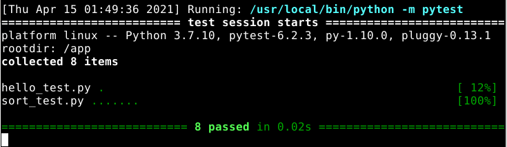

# DSC Lab TDD Fun Times

Clone this project for the code Kata at the April 16, 2021 Descision Science and Control Lab meeting.

## Python

If you have Python 3, you can try installing `pytest-watch` and then running `ptw` in this directory. Or, if you have docker, you should be able to run

```
docker build -t pythonkata .
docker run -v $(pwd):/app/ --workdir=/app -it pythonkata ptw
```

and eventually see something like this:


